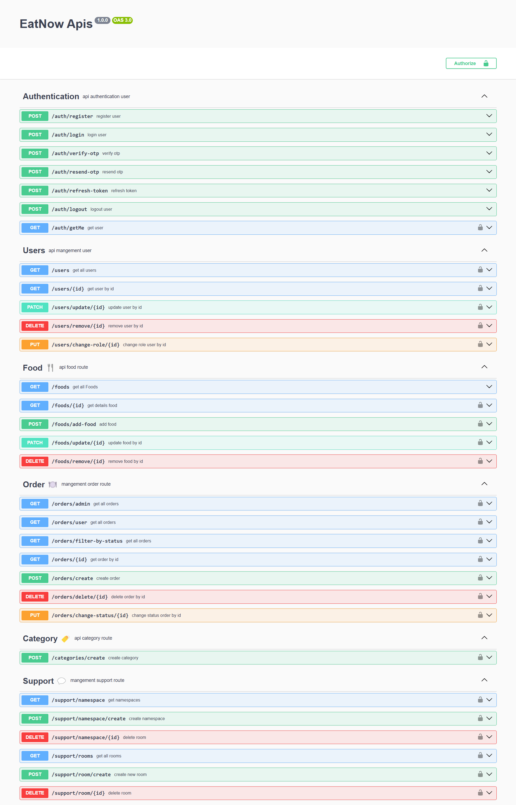

# **EatNow**

### **About**
EatNow is a smart platform for online food ordering that provides users with a fast, convenient, and enjoyable experience. Users can browse a wide menu of fast food and home-cooked meals, easily place orders, and take advantage of discounts and special offers.

---

## **Technologies**
The project is developed using the following technologies:
- **GraphQL**
- **Express.js**
- **TypeScript**
- **Socket.IO**
- **PostgreSQL**
- **Swagger**
- **Bcrypt**
- **JSON Web Token (JWT)**

---

## Project Structure

The project is organized into multiple layers for better separation of concerns:

```
    src/ 
        |-- configs/ 
        | |-- db.config.ts # Database connection configuration 
        |-- constants/ 
        | |-- constants.ts # Application-wide constants
        |-- errors/
        | |-- customError.ts
        |-- graphql/
        | -- resolver/
        |   |--blog.resolver.ts
        |   |--category.resolver.ts
        |   |--comment.resolver.ts
        |   |--discount.resolver.ts
        | -- types/
        |   |--blog.types.ts
        |   |--category.types.ts
        |   |--comment.types.ts
        |   |--discount.types.ts
        |   |--response.types.ts
        |   |--user.types.ts
        | |-- graphql.context.ts
        | |-- index.resolver.ts
        |-- middlewares/ 
        | |-- guard/ 
        |   |-- admin.guard.ts
        |   |-- authenticate.guard.ts
        | |-- uploader.middleware.ts # File upload handling 
        |-- modules/
        | |-- api/
        |   |-- swagger.json
        |   |-- swagger.routes.ts
        | |-- auth/
        |   |-- auth.controller.ts
        |   |-- auth.routes.ts
        |   |-- auth.service.ts
        |   |-- auth.validation.ts
        | |-- blog/
        |   |-- blog.interface.ts
        |   |-- blog.model.ts
        |   |-- blog.validation.ts
        | |-- category/
        |   |-- category.controller.ts
        |   |-- category.interface.ts
        |   |-- category.model.ts
        |   |-- category.routes.ts
        |   |-- category.service.ts
        |   |-- category.validation.ts
        | |-- comment/
        |   |-- comment.interface.ts
        |   |-- comment.model.ts
        | |-- discount/
        |   |-- discount.interface.ts
        |   |-- discount.model.ts
        |   |-- discount.validation.ts
        | |-- food/
        |   |-- food.controller.ts
        |   |-- food.interface.ts
        |   |-- food.model.ts
        |   |-- food.routes.ts
        |   |-- food.service.ts
        |   |-- food.validation.ts
        | |-- order/
        |   |-- order.controller.ts
        |   |-- order.interface.ts
        |   |-- order.model.ts
        |   |-- order.routes.ts
        |   |-- order.service.ts
        |   |-- order.validation.ts
        | |-- socket/
        |   |-- socket.service.ts
        | |-- support/
        |   |-- conversation.model.ts
        |   |-- location.model.ts
        |   |-- message.model.ts
        |   |-- order.routes.ts
        |   |-- namespace.controller.ts
        |   |-- namespace.service.ts
        |   |-- room.controller.ts
        |   |-- room.model.ts
        |   |-- room.service.ts
        |   |-- support.controller.ts
        |   |-- support.interface.ts
        |   |-- support.routes.ts
        |   |-- support.service.ts
        |   |-- support.validation.ts
        | |-- user/
        |   |-- support.controller.ts
        |   |-- support.interface.ts
        |   |-- support.model.ts
        |   |-- support.routes.ts
        |   |-- support.service.ts
        |   |-- support.validation.ts
        |-- routes/ # Define routes for each module 
        | |-- index.routes.ts 
        |-- types/
        | |--index.ts
        |-- utils/ # Utility functions 
        | |-- function.utils.ts 
        | |-- token.utils.ts # Token generation and verification 
        |-- app.ts
        |-- server.ts # Server setup and entry point 
        |-- .env # Environment variables 
        |-- .gitignore # Files and folders to be ignored by Git 
        |-- package.json # Dependencies and scripts 
        |-- package-lock.json # Locked dependency versions
        |-- tsconfig.json
```

## Image



## **API Documentation**

### **Authentication**
This section manages user registration, login, and authentication:

| Method | Endpoint               | Description                 |
|--------|------------------------|-----------------------------|
| `POST` | `/auth/register`       | Register a new user         |
| `POST` | `/auth/login`          | Login                       |
| `POST` | `/auth/verify-otp`     | Verify OTP code             |
| `POST` | `/auth/resend-otp`     | Resend OTP code             |
| `POST` | `/auth/refresh-token`  | Refresh access token        |
| `POST` | `/auth/logout`         | Logout                      |
| `GET`  | `/auth/getMe`          | Get user information        |

---

### **Users**
Manage user information:

| Method   | Endpoint                | Description                       |
|----------|-------------------------|-----------------------------------|
| `GET`    | `/users`                | Get all users                     |
| `GET`    | `/users/{id}`           | Get user by specific ID           |
| `PATCH`  | `/users/update/{id}`    | Update user information           |
| `DELETE` | `/users/remove/{id}`    | Remove user                       |
| `PUT`    | `/users/change-role/{id}` | Change user role                |

---

### **Food**
Manage the food menu:

| Method   | Endpoint                | Description                       |
|----------|-------------------------|-----------------------------------|
| `GET`    | `/foods`                | Get the list of foods             |
| `GET`    | `/foods/{id}`           | Get details of a specific food    |
| `POST`   | `/foods/add-food`       | Add a new food item               |
| `PATCH`  | `/foods/update/{id}`    | Update a specific food            |
| `DELETE` | `/foods/remove/{id}`    | Remove food item                  |

---

### **Order**
Manage user orders:

| Method   | Endpoint                   | Description                       |
|----------|----------------------------|-----------------------------------|
| `GET`    | `/orders/admin`            | Get all orders (admin)            |
| `GET`    | `/orders/user`             | Get user orders                   |
| `GET`    | `/orders/filter-by-status` | Filter orders by status           |
| `GET`    | `/orders/{id}`             | Get details of a specific order   |
| `POST`   | `/orders/create`           | Create a new order                |
| `DELETE` | `/orders/delete/{id}`      | Delete an order                   |
| `PUT`    | `/orders/change-status/{id}` | Change order status             |

---

### **Category**
Manage menu categories:

| Method | Endpoint                | Description                       |
|--------|-------------------------|-----------------------------------|
| `POST` | `/categories/create`    | Create a new category             |

---

### **Support**
Manage the support section for communication between users and admins:

| Method   | Endpoint                     | Description                       |
|----------|------------------------------|-----------------------------------|
| `GET`    | `/support/namespace`         | Get existing namespaces           |
| `POST`   | `/support/namespace/create`  | Create a new namespace            |
| `DELETE` | `/support/namespace/{id}`    | Delete a namespace                |
| `GET`    | `/support/rooms`             | Get the list of support rooms     |
| `POST`   | `/support/room/create`       | Create a new support room         |
| `DELETE` | `/support/room/{id}`         | Delete a specific support room    |

---

# **GraphQL**

The project also exposes a GraphQL endpoint, which allows for more flexible queries and mutations. Here are the available GraphQL queries and mutations:

## **Root Queries**

* **getAllCategories** – Retrieve all food categories.
* **getCategoryById(id: ID)** – Retrieve a specific category by ID.
* **getAllCommentsForAdmin** – Get all comments for admin review.
* **getAllComment** – Retrieve all comments.
* **getCommentById(id: ID)** – Get a specific comment by ID.
* **getAllBlogsForAdmin** – Retrieve all blogs for admin review.
* **getAllBlogs** – Get a list of blogs.
* **getBlogById(id: ID)** – Get a specific blog by ID.
* **getAllDiscounts** – Retrieve all discounts.

## **Root Mutations**

* **removeCategoryById(id: ID)** – Remove a category by ID.
* **createComment(comment: CommentInput)** – Create a new comment.
* **removeCommentById(id: ID)** – Remove a comment by ID.
* **acceptComment(id: ID)** – Accept a comment.
* **rejectComment(id: ID)** – Reject a comment.
* **answerComment(id: ID, answer: String)** – Answer a comment.
* **createBlog(blog: BlogInput)** – Create a new blog.
* **removeBlogById(id: ID)** – Remove a blog by ID.
* **updateBlog(id: ID, blog: BlogInput)** – Update a specific blog.
* **createDiscount(discount: DiscountInput)** – Create a new discount.
* **deleteDiscount(id: ID)** – Delete a discount.
* **updateDiscount(id: ID, discount: DiscountInput)** – Update a discount.
* **changeDiscountStatus(id: ID, status: Boolean)** – Change the status of a discount.

The GraphQL endpoint is available at /graphql.

## **Installation & Setup**

To set up the project, follow these steps:


1. **Clone the repository:**
   ```bash
   git clone https://github.com/Hossein-Falah/EatNow.git
   cd EatNow
   ```

2. **Install dependencies:**
   ```bash
   npm install
   ```

3. **Set up the database:**
   - Ensure PostgreSQL is installed and configured.

4. **Set environment variables:**
   Create a .env file with appropriate values.

   ```env
   PORT=8000
   DB_HOST=localhost
   DB_USER=your_db_user
   DB_PASS=your_db_password
   JWT_SECRET=your_jwt_secret
   ```

5. **Run the project:**
   ```bash
   npm run dev
   ```

---

## **Usage**
Once the project is running:
- **API** documentation is available via Swagger UI at `/api-doc`.
- **Socket.IO** is used for live communication between users and admins.
- **GraphQL** can be accessed at `/graphql`.

---

## **Features**
- **Registration and Authentication** with OTP
- **Order Management** with status filtering
- **Online Support** using Socket.IO
- **Menu Management** with categories
- **GraphQL** for flexible queries and mutations

---

## **License**

This project is licensed under the **MIT** License.

---

## **Contributing**
We welcome contributions to EatNow! To contribute, please follow these steps:

- Fork the repository.
- Create a new branch **(git checkout -b feature-branch)**.
- Make your changes and commit them **(git commit -am 'Add new feature')**.
- Push to your branch **(git push origin feature-branch)**.
- Create a new Pull Request.
